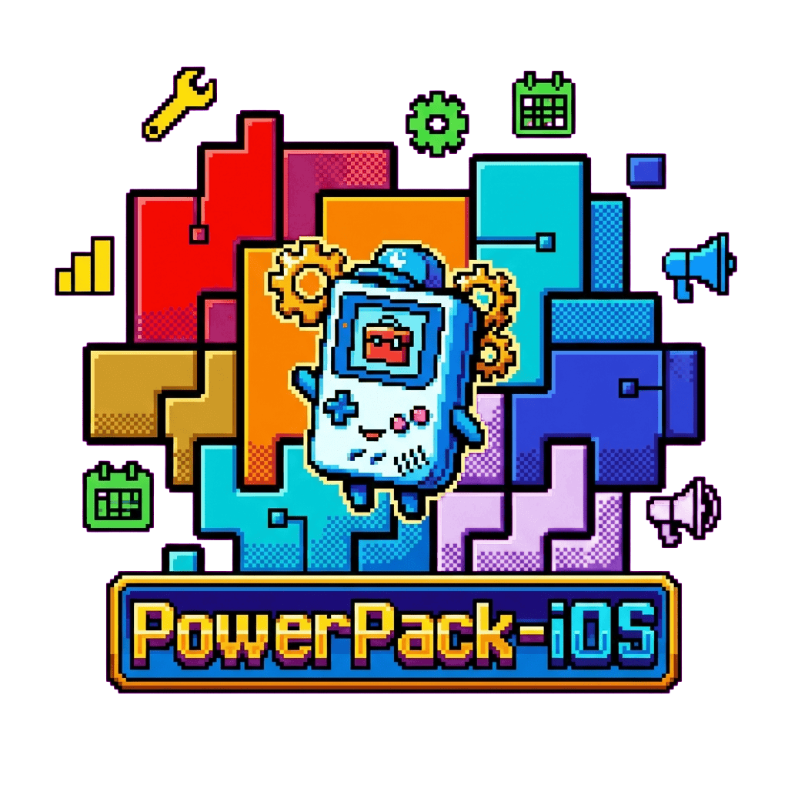

> [!WARNING]
> ## Archived
> This project is archived and no longer maintained.
>
> iOS APIs and development patterns have evolved significantly since this library was written. UIKit patterns, block-based APIs, and tooling have all changed substantially — newer Swift-first alternatives provide better ergonomics for modern iOS development.

<div align="center">
  

  [](http://cocoapods.org/pods/PowerPack-iOS)
  [](http://cocoapods.org/pods/PowerPack-iOS)
  [](http://cocoapods.org/pods/PowerPack-iOS)

  **🔧 Objective-C category extensions that cut iOS boilerplate across 27+ UIKit and Foundation classes 📱**

</div>

## Overview

Every iOS app reimplements the same patterns — hex colors, block-based alerts, safe array access, date formatting. PowerPack-iOS bundles the most frequently needed helpers into a single CocoaPods drop-in, so you stop copying utilities between projects and start shipping features.

**27 categories. One pod. Zero boilerplate.**

## Features

**Foundation Extensions**

- `NSArray+PowerPack` — safe access, filtering, and mapping helpers
- `NSMutableArray+PowerPack` — in-place manipulation utilities
- `NSCalendar+PowerPack` — date arithmetic helpers
- `NSData+PowerPack` — encoding and hashing conveniences
- `NSDate+PowerPack` — formatting, comparison, and range utilities
- `NSDateFormatter+PowerPack` — common format presets
- `NSObject+PowerPack` — runtime and KVC helpers
- `NSString+PowerPack` — trimming, validation, and parsing utilities

**UIKit Extensions**

- `UIActionSheet+PowerPack` — block-based action sheet callbacks
- `UIAlertView+PowerPack` — block-based alert view callbacks
- `UIApplication+PowerPack` — app info and environment helpers
- `UIBarButtonItem+PowerPack` — quick initializers
- `UIButton+PowerPack` — image and state convenience setters
- `UIColor+PowerPack` — hex initialization and color blending
- `UIDatePicker+PowerPack` — binding and value extraction
- `UIDevice+PowerPack` — model detection and system info
- `UIFont+PowerPack` — dynamic type and system font helpers
- `UIImage+PowerPack` — resizing, masking, and GPU processing via GPUImage
- `UINavigationController+PowerPack` — push/pop with completion blocks
- `UIPickerView+PowerPack` — data binding helpers
- `UIScreen+PowerPack` — resolution and scale utilities
- `UIScrollView+PowerPack` — content offset and scroll helpers
- `UITableView+PowerPack` — cell registration and dequeue helpers
- `UITableViewCell+PowerPack` — reuse identifier conventions
- `UITextField+PowerPack` — input validation and formatting
- `UIView+PowerPack` — layout, animation, and hierarchy utilities
- `UIViewController+PowerPack` — presentation and dismissal helpers

**Social**

- `SLComposeViewController+PowerPack` — social sharing helpers

## ⚡ Quick Start

Add to your `Podfile`:

```ruby
pod "PowerPack-iOS"
```

Then install:

```bash
pod install
```

## Requirements

- iOS 6.0+
- Objective-C (ARC required)
- CocoaPods

**Dependencies:**

- [Reachability](https://github.com/tonymillion/Reachability) — network reachability
- [GPUImage](https://github.com/BradLarson/GPUImage) — GPU-accelerated image processing
- [Parse](https://parseplatform.org/) — backend integration
- [ParseUI](https://github.com/parse-community/ParseUI-iOS) — Parse UI components
- [ParseFacebookUtils](https://github.com/parse-community/ParseFacebookUtils-iOS) — Facebook login via Parse

## Usage

Clone the repo and run `pod install` from the `Example` directory to explore the example project:

```bash
git clone https://github.com/tsilva/PowerPack-iOS.git
cd PowerPack-iOS/Example
pod install
open PowerPack-iOS.xcworkspace
```

## Author

Tiago Silva — [eng.tiago.silva@gmail.com](mailto:eng.tiago.silva@gmail.com)

## License

PowerPack-iOS is available under the MIT License. See the [LICENSE](LICENSE) file for details.
